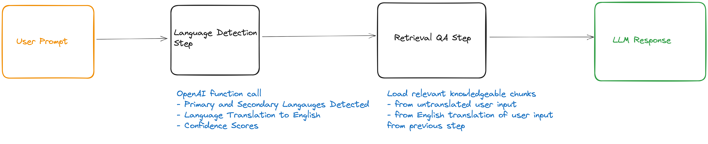

# Open-LLM

This project aims to take Glific interactions to the next level by seamlessly integrating OpenAI's Language Model to generate contextually accurate responses from the custom knowledge base. This will be a standalone repository within the Glific ecosystem and will be hosted separately. Through the use of Glific webhooks, this will be connected to the Glific instance for better contextual response through the chatbot

## Architecture



## Development

### Prerequisites

#### Python & pip

Make sure you have Python and pip installed. You can check this by running:

```bash
python --version
pip --version
```

#### Pipenv

This project uses [pipenv](https://pipenv.pypa.io/en/latest/) for dependency management. To install pipenv, run:

```bash
pip install pipenv --user
```

## Getting Started

### .env

Run `cp .env.example .env` file and add your OpenAI key.

### Start database

We are using Postgres to store conversation history. You can start the database using docker-compose:

```bash
docker-compose up
```

### Project dependencies

This project uses Python 3.9 and virtual environments:

Create a virtualenv:

```bash
python -m venv venv
```

Activate the virtualenv:

```bash
source venv/bin/activate
```

Install the dependencies, run:

```bash
pip install -r requirements.txt
```

Run migration

```bash
python manage.py migrate
```

### Start the server

```bash
python manage.py runserver
```

### Seeding

To seed the database with a sample organization, open a python shell (`python manage.py shell`) and run the following command:

```python
from llm.models import Organization
Organization.objects.create(
  name="Myna Mahila",
  system_prompt="I want you to act as a chatbot for providing tailored sexual and reproductive health advice to women in India. You represent an organization called The Myna Mahila Foundation (mynamahila.com), an Indian organization which empowers women by encouraging discussion of taboo subjects such as menstruation, and by setting up workshops to produce low-cost sanitary protection to enable girls to stay in school. In India, majority of girls report not knowing about menstruation before their first period. This is because of limited access to unbiased information due to stigma, discrimination, and lack of resources. The information you provide needs to be non-judgmental, confidential, accurate, and tailored to those living in urban slums. Your response should be in the same language as the user's input.",
  api_key="sk_ABC123",
)
```

To make requests to the API with the organization's API key, use the following command:

```bash
curl -X POST -H "Authorization: sk_ABC123" -H "Content-Type: application/json" -d '{"system_prompt":"You are a chatbot that formats your responses as poetry."}' http://localhost:8000/api/system_prompt
```

To upload a file from `llm/data/sources/*` and ultimately create embeddings out of it, use the following command:

```bash
curl -X POST -H "Authorization: sk_ABC123" -H "Content-Type: multipart/form-data" -F "file=@llm/data/sources/ANXIETY.docx.pdf" http://localhost:8000/api/upload
```

For testing and convenience, running the `upload_docs.sh` script will upload all the files in `llm/data/sources/*` for embeddings to be created out of them.

```bash
./upload_docs.sh
```

### Query

For testing the LLM, we are using [HTTPie](https://httpie.io) because of its succint syntax. You may alternatively use curl or Postman or your favorite HTTP client for this.

You can query the LLM using the following command:

```bash
curl -X POST -H "Authorization: sk_ABC123" -H "Content-Type: application/json" -d '{"prompt": "Peshab ki jagah se kharash ho rahi hai"}' http://localhost:8000/api/chat
```

This will return a JSON endpoint with the LLM response as well as a session id.

```json
{
  "answer": "Aapki samasya ke liye dhanyavaad. Yah peshab ke samay kharash ki samasya ho sakti hai. Isko urinary tract infection (UTI) kaha jata hai. Urinary tract infection utpann hone ka mukhya karan antarik infection ho sakta hai.",
  "chat_history": [],
  "session_id": "uhh0pq"
}
```

To ask a fellow up question, you can use the session id returned in the previous response:

```bash
curl -X POST -H "Authorization: sk_ABC123" -H "Content-Type: application/json" -d '{"prompt":"Peshab ki jagah kharash hai","session_id":"uhh0pq"}' http://127.0.0.1:8000/api/chat
```

```json
{
  "answer": "aapki samasya ke liye dhanyavad. Yah peshaab ki jagah me kharash ho sakti hai. Isko urinary tract infection (UTI) kaha jata hai. UTI utpann hone ka mukhya karan aantarik infection ho sakta hai.",
  "chat_history": [
    [
      ["content", "Peshab ki jagah se kharash ho rahi hai"],
      ["additional_kwargs", {}],
      ["type", "human"],
      ["example", false]
    ],
    [
      [
        "content",
        "Aapki samasya ke liye dhanyavaad. Yah peshab ke samay kharash ki samasya ho sakti hai. Isko urinary tract infection (UTI) kaha jata hai. Urinary tract infection utpann hone ka mukhya karan antarik infection ho sakta hai."
      ],
      ["additional_kwargs", {}],
      ["type", "ai"],
      ["example", false]
    ]
  ],
  "session_id": "uhh0pq"
}
```

The default model used is [`gpt-3.5-turbo`](https://platform.openai.com/docs/models/gpt-3-5) but you can specify a different GPT model by passing a `gpt_model` parameter in the request body.

```bash
curl -X POST -H "Authorization: sk_ABC123" -H "Content-Type: application/json" -d '{"prompt":"Mujhe peshab ki jagah pe kharash ho rahi hai","gpt_model":"gpt-3.5-turbo-16k"}' http://127.0.0.1:8000/api/chat
```

```json
{
  "answer": "Aapki samasya ke liye dhanyavaad. Yah peshaab karne ke samay kharash ki samasya ho sakti hai. Isko urinary tract infection (UTI) kaha jata hai. UTI utpann hone ka mukhya karan aantrik infection ho sakta hai.",
  "chat_history": [],
  "session_id": "cfbQXg"
}
```

### Evaluation

To use an secondary LLM to evaluate the output of the primary LLM, users can set the evaluator prompt at the organization level:

REFERENCE G-EVAL PROMPT:

```
You will be given one summary written for a news article.
Your task is to rate the summary on one metric.
Please make sure you read and understand these instructions carefully. Please keep this
document open while reviewing, and refer to it as needed.
Evaluation Criteria:
Coherence (1-5) - the collective quality of all sentences. We align this dimension with
the DUC quality question of structure and coherence whereby ”the summary should be
well-structured and well-organized. The summary should not just be a heap of related information, but should build from sentence to sentence to a coherent body of information about a topic.”
Evaluation Steps:
1. Read the news article carefully and identify the main topic and key points.
2. Read the summary and compare it to the news article. Check if the summary covers the main
topic and key points of the news article, and if it presents them in a clear and logical order.
3. Assign a score for coherence on a scale of 1 to 5, where 1 is the lowest and 5 is the highest
based on the Evaluation Criteria.
Example:
Source Text:
{{Document}}
Summary:
{{Summary}}
Evaluation Form (scores ONLY):
- Coherence:
```

```sh
curl --request POST \
  --url http://localhost:8000/api/evaluator_prompt \
  --header 'Authorization: sk_ABC123' \
  --header 'Content-Type: application/json' \
  --data '{
  "evaluator_prompts": {
    "friendliness": "You will be given a response from a womens health chatbot.\nYour task is to rate the response on one metric.\nPlease make sure you read and understand these instructions carefully. Please keep this document open while reviewing, and refer to it as needed.\n\nEvaluation Criteria:\nFriendliness (1-10) - how friendly the response is to an audience of women who traditionally do not have open conversations about health issues due to stigma.\n\nEvaluation Steps:\n1. Read the chatbot response in detail.\n2. Analyze the tone and word choice of the response.\n3. Considering the women are talking to this chatbot in private, assess whether the response is considerate of their situation.\n4. Assign an integer score for friendliness on a scale of 1 to 10, where 1 is the lowest and 10 is the highest based on the Evaluation Criteria.\n\nExample:\nUser Question:\n{{Question}}\nChatbot Response:\n{{Response}}\n\nEvaluation Form (scores ONLY):\n- Friendliness:",
    "factuality": "You will be given a response from a women'\''s health chatbot. Your task is to rate the factual accuracy of the response. Please be certain you have understood these instructions, keep this document open during the process for reference as needed.\nEvaluation Criteria:\nFactuality (1-10) - assess the degree to which the given response accurately reflects current, scientifically-backed knowledge in the field of women'\''s health.\nEvaluation Steps:\n1. Carefully review the chatbot response.\n2. Compare and contrast the information in the response with your knowledge and/or verified sources.\n3. Assess the correct presentation of facts and utilization of credible, scientific information.\n4. Based on the Evaluation Criteria, assign a integer score for factuality on a scale of 1 to 10. 1 indicates entirely inaccurate, whilst 10 suggests perfect factual accuracy.\nExample:\nUser Question:\n{{Question}}\nChatbot Response:\n{{Response}}\nEvaluation Form (scores ONLY):\nFactuality:"
  }
}'
```

To run the evaluator, you simply call the chat endpoint with the `evaluator` parameter set to `true`:

```sh
curl -X POST -H 'Authorization: sk_ABC123' -H 'Content-Type: application/json' -d '{"evaluate": true, "prompt": "Peshab ki jagah se kharash ho rahi hai"}' http://localhost:8000/api/chat
```

The response will include your specific evaluation scores in a `evaluation_scores` key in the response:

```json
{
  "answer": "Aapki samasya ke liye dhanyavaad. Yah peshab ke samay kharash ki samasya ho sakti hai. Isko urinary tract infection (UTI) kaha jata hai. Urinary tract infection utpann hone ka mukhya karan antarik infection ho sakta hai.",
  "chat_history": [],
  "evaluation_scores": {
    "coherence": 4,
    "consistency": 3
  },
  "session_id": "uhh0pq"
}
```
